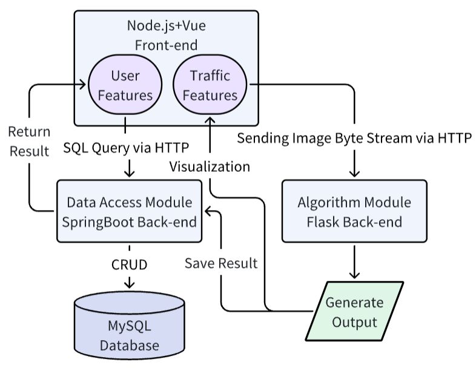

# Traffic Flow Recognition System Back-end

The Back-end of a Traffic Flow Recognition System.

The Traffic Flow Recognition System is build up with three module. One is this Back-end, a web [Front-end](https://github.com/DavidZhang0710/x-admin-web/tree/project), and a Flask Back-end to provide algorithm API.

The framework and workflow diagram are as shown in the followed figure.



## Getting Started

These instructions will get you a copy of the project up and running on your local machine for development.

### Prerequisites

Software/Package version this project used:

```
JDK == 1.8
SpringBoot == 2.7.6
Maven == 4.0.0
Redis == 3.2.100
MySQL == 5.7.44
```

### Installing

Clone the project and open it with IDEA

```
# clone the project
git clone -b project https://github.com/DavidZhang0710/x-admin-web.git
```

Here you have a project ready to run.

## Running

First you need to set up the configuration in ```src\main\resources\application.yml```, and make sure the ports of database or Redis are yours.

Then you can use IDEA to run the project.

## Built With
* [Spring Boot](https://spring.io/projects/spring-boot) - The back-end framework used
* [Maven](https://maven.apache.org/) - Dependency Management
* [Mybatis](https://mybatis.org/mybatis-3/) - Used to bind SQL statements
* [Redis](https://redis.io/) - Used to cache data in database


## License

This project is licensed under the MIT License - see the [LICENSE](LICENSE) file for details